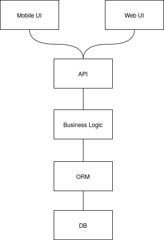
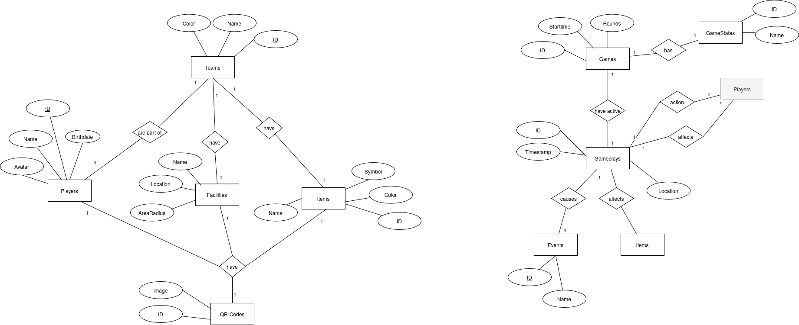

# Capture The Flag (CTF)

## Use Cases
For details on game scenarios refer to [scenarios folder](./scenarios/Readme.md).

## Intended Software Architecture
The software architecture uses a layered architecture design and decoupling through the implementation of an application programming interface (API).

## Draft of Database Design 
The basic database design is outlined in the following entity-relationship model.

## Ideas
Further ideas that will be examined in more detail and implemented if necessary at a later date:

- [Event Driven Architecture](https://serverlessland.com/)
- [Amazon Location Service](https://aws.amazon.com/de/location/)
- incorporating NFC tags
- using Openstreet maps 
- geo locations by Smartphone sensor
- movements by Smartphone sensor
- speeds by Smartphone sensor
- voice communication with in-ear headphones
- decentralized / mesh wireless connections, e.g. 
  - WI-FI Direct
  - LoRa Mesh (e.g. Helium)